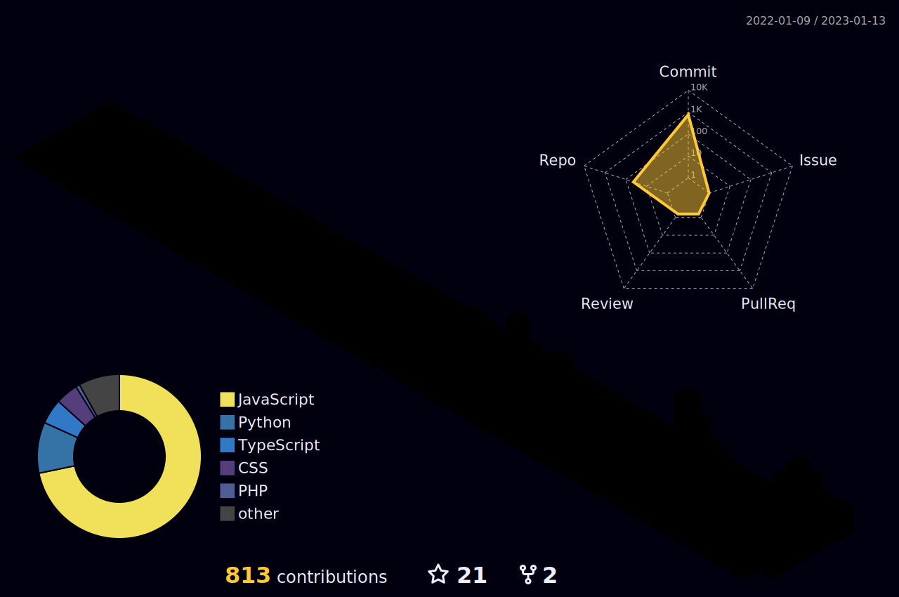

  <h2>🧑🏻‍💻 Working On..</h2>
  <table align="center">
    <thead>
      <tr>
        <th>Title</th>
        <th>Description</th>
        <th>Image</th>
        <th>Links</th>
      </tr>
    </thead>
    <tbody>
      <tr>
        <td>clickfusion</td>
        <td>React-based npm package designed to enhance your UI with a variety of interactive and customizable particle effects for buttons and other clickable elements</td>
        <td>
          
        </td>
        <td>
          
          
          
        </td>
      </tr>
    </tbody>
  </table>

  <h2>💼 Recent Projects</h2>
  <table align="center">
    <thead>
      <tr>
        <th>Title</th>
        <th>Description</th>
        <th>Image</th>
        <th>Links</th>
      </tr>
    </thead>
    <tbody>
        <tr>
        <td>quick-readme</td>
        <td>A CLI tool to generate README files super fast and easily!</td>
        <td>
          
        </td>
        <td>
          
          
        </td>
      </tr>
      <tr>
        <td>auto-header-est2023</td>
        <td>Automatically insert header comments tailored to your preferences for every file you create. - VSCode extension</td>
        <td>
          
        </td>
        <td>
          
        </td>
      </tr>
      <tr>
        <td>tribe-api-wrapper</td>
        <td>This package is designed to offer an accessible and efficient interface for the Tribe Leaderboard API</td>
        <td>
          
        </td>
        <td>
          
          
          
        </td>
      </tr>
      <tr>
        <td>repo2pdf</td>
        <td>Repo-to-PDF is a tool that allows you to convert a GitHub repository into a PDF file. It clones the repository, processes the files, and then creates a PDF.</td>
        <td>
          
        </td>
        <td>
          
          
          
        </td>
      </tr>
      <tr>
        <td>nextension</td>
        <td>An Advanced CLI Tool for Building Next.js Applications as Chrome Extensions</td>
        <td>
          
        </td>
        <td>
          
          
        </td>
      </tr>
      <tr>
        <td>Rainbowkit Playground</td>
        <td>Interactively play with RainbowKit components</td>
        <td align="center">
          
        </td>
        <td>
          
          
        </td>
      </tr>
      <tr>
        <td>AskGit AI</td>
        <td>Code Smarter, Not Harder: Enhance Your GitHub Experience with AskGit, the AI-Coding Assistant!</td>
        <td>
          
        </td>
        <td>
          
        </td>
      </tr>
        <td>Snapshot Tool - thirdweb</td>
        <td>A simple tool for fetching NFT balances from a smart contract. Supports all ERC-721 contracts.</td>
        <td>
          
        </td>
        <td>
          
          
        </td>
      </tr>
      <tr>
        <td>NFT Generator</td>
        <td>NFTGEN is an open-source tool for generating unique NFT images or GIFs, complete with metadata. You can easily customize and configure NFTGEN to suit your needs and generate your own NFTs in just a few simple steps. Easily upload directly to IPFS.</td>
        <td>
          
        </td>
        <td>
          
        </td>
      </tr>
    </tbody>
  </table>

<h2 align="center">Github stats :bar_chart:</h2>
<table>
  <tr>
    <td valign="top" width="60%">
      
    </td>
    <td valign="top" width="40%">
      <h2 align="center">🏆 Trophys</h2>
      
    </td>
  </tr>
  <tr>
    <td colspan="6" valign="center">
      
    </td>
  </tr>
</table>

<h2>🛠️ Skills</h2>
<table>
  <tr>
    <th colspan="7" align="center">Favorite Skills</th>
  </tr>
  <tr>
    <td align="center">
      
       Typescript
    </td>
    <td align="center">
      
       Next.js
    </td>
    <td align="center">
      
       Tailwind CSS
    </td>
  </tr>
  <tr>
    <th colspan="7" align="center">Front-end Development</th>
  </tr>
  <tr>
    <td align="center">
      
       Javascript
    </td>
    <td align="center">
      
       React
    </td>
    <td align="center">
      
       HTML
    </td>
    <td align="center">
      
       CSS
    </td>
    <td align="center">
      
       Bootstrap
    </td>
    <td align="center">
      
       JQuery
    </td>
  </tr>
  <tr>
    <th colspan="7" align="center">Back-end Development</th>
  </tr>
  <tr>
    <td align="center">
      
       Node.js
    </td>
    <td align="center">
      
       Express
    </td>
    <td align="center">
      
       Python
    </td>
    <td align="center">
      
       Firebase
    </td>
    <td align="center">
      
       Supabase
    </td>
  </tr>
  <tr>
    <th colspan="7" align="center">Other Skills</th>
  </tr>
  <td align="center">
    
     Solidity
  </td>
  <td align="center">
    
     Discord API
  </td>
  <td align="center">
    
     Twitter API
  </td>
  <td align="center">
    
     Bots
  </td>
  <td align="center">
    
     Vercel
  </td>
  <td align="center">
    
     Netlify
  </td>
  </tr>
</table>

<h2> 🖥️ Workspace Setup</h2>
<table>
  <tr>
    <td>
      
    </td>
    <td>
      
    </td>
  </tr>
  <tr>
    <td>
      
    </td>
    <td>
      
    </td>
  </tr>
  <tr>
    <td>
      
    </td>
    <td>
      
    </td>
  </tr>
  <tr>
    <td>
      
    </td>
    <td>
      
    </td>
  </tr>
</table>
<h4 align="center">Visitor's count :eyes:</h4>

  

  
  
  
  
  

