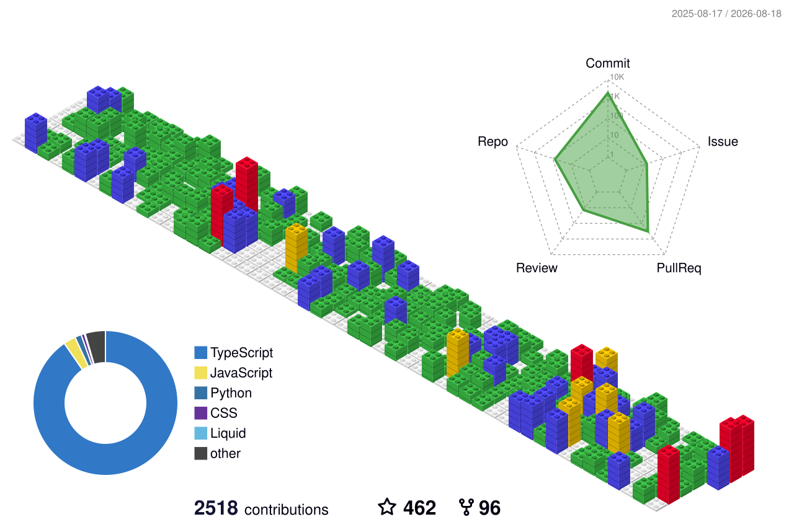
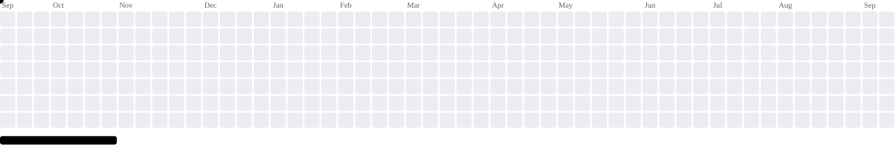

<a href="https://gitroll.io/profile/uSKBUAuwEu2OiuJtJx1Oq1MDhL8S2">
  <picture>
    <source media="(prefers-color-scheme: dark)" srcset="https://gitroll.io/api/badges/profiles/v1/uSKBUAuwEu2OiuJtJx1Oq1MDhL8S2?theme=midnight" />
    
  </picture>
</a>

<picture>
  <source media="(prefers-color-scheme: dark)" srcset=".github/images/snake-dark.svg" />
  <source media="(prefers-color-scheme: light)" srcset=".github/images/snake.svg" />
  
</picture>

<picture>
  <source media="(prefers-color-scheme: dark)" srcset=".github/images/pacman-dark.svg" />
  <source media="(prefers-color-scheme: light)" srcset=".github/images/pacman.svg" />
  
</picture>

<picture>
  <source media="(prefers-color-scheme: dark)" srcset=".github/images/breakout-dark.svg" />
  <source media="(prefers-color-scheme: light)" srcset=".github/images/breakout.svg" />
  
</picture>

<picture>
  <source media="(prefers-color-scheme: dark)" srcset=".github/images/galaga-dark.svg" />
  <source media="(prefers-color-scheme: light)" srcset=".github/images/galaga.svg" />
  
</picture>

<picture>
  <source media="(prefers-color-scheme: dark)" srcset=".github/images/puzzle-bobble-dark.svg" />
  <source media="(prefers-color-scheme: light)" srcset=".github/images/puzzle-bobble.svg" />
  
</picture>

<picture>
  <source media="(prefers-color-scheme: dark)" srcset=".github/images/bomberman-dark.svg" />
  <source media="(prefers-color-scheme: light)" srcset=".github/images/bomberman.svg" />
  
</picture>

<picture>
  <source media="(prefers-color-scheme: dark)" srcset=".github/images/minesweeper-dark.svg" />
  <source media="(prefers-color-scheme: light)" srcset=".github/images/minesweeper.svg" />
  
</picture>

