  <!-- GitRoll Badge -->
  

    
  

  <!-- Pac-Man Contribution Graph -->
  <picture>
    <source media="(prefers-color-scheme: dark)" srcset=".github/images/github-contribution-grid-pacman-dark.svg" />
    <source media="(prefers-color-scheme: light)" srcset=".github/images/github-contribution-grid-pacman.svg" />
    
  </picture>
  
  <!-- Snake Contribution Graph -->
  <picture>
    <source media="(prefers-color-scheme: dark)" srcset=".github/images/github-contribution-grid-snake-dark.svg" />
    <source media="(prefers-color-scheme: light)" srcset=".github/images/github-contribution-grid-snake.svg" />
    
  </picture>

  <!-- Activity Graph -->
  

    
  

<!-- GitHub Metrics -->

  <h2>
    
    <b>GitHub Metrics</b>
    
  </h2>
  

    
  

